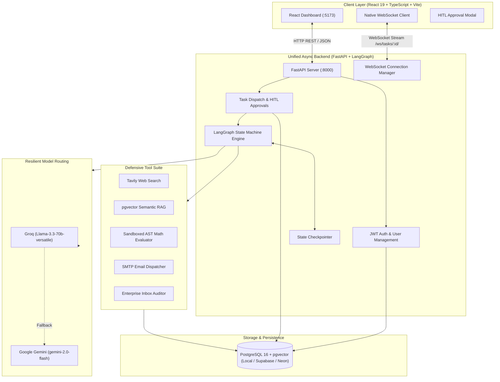
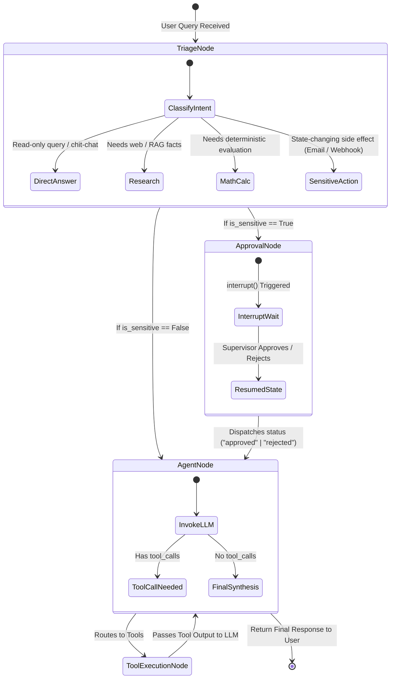

# AmbientDesk AI 🌐🤖

<div align="center">


### **Production-Grade Autonomous Multi-Agent Workspace with Human-in-the-Loop (HITL) Guardrails & Real-Time Streaming**

[](https://www.python.org/)
[](https://fastapi.tiangolo.com/)
[](https://github.com/langchain-ai/langgraph)
[](https://react.dev/)
[](https://github.com/pgvector/pgvector)
[](https://vite.dev/)
[](LICENSE)

[Quick Start](#-quick-start-native-execution) • [Key Features](#-key-features) • [System Architecture](#-system-architecture) • [Showcase Prompts](#-showcase-prompts-to-test-the-system) • [Deployment Guide](DEPLOYMENT.md)

</div>

---

## 📌 Executive Overview

**AmbientDesk AI** is an enterprise-grade agentic operating system designed to triage, orchestrate, and execute complex workflows autonomously while maintaining strict **Human-in-the-Loop (HITL)** governance and state persistence.

Powered by a lightweight, high-performance **Pure FastAPI + LangGraph** async backend and a modern **React 19 + Vite** interface:
1. **Intelligent Triage & Intent Routing**: Directs prompts to deterministic computation, web intelligence, internal vector search (`pgvector`), or sensitive execution pipelines.
2. **LangGraph State Machine with `interrupt()`**: Halts execution before state-changing side effects (SMTP email, alerts, mutations) for explicit human authorization.
3. **Resilient Dual-Model LLM Routing**: Primary ultra-fast inference via **Groq (Llama 3.3 70B)** with automated fallback to **Google Gemini 2.0 Flash**.
4. **Native Async WebSockets**: Direct full-duplex WebSocket streaming for real-time node transitions, tool execution logs, and LLM tokens.

---

## 📸 System Visuals & UI Walkthrough

<div align="center">


*Real-time LangGraph multi-agent execution pipeline with Human-in-the-Loop (HITL) approval modal, pgvector RAG status, and live tool telemetry.*

</div>

---

## 🚀 Key Features

| Capability | Technical Implementation | Benefit |
| :--- | :--- | :--- |
| **Multi-Agent State Graph** | LangGraph `StateGraph` + `MemorySaver` checkpointer | Stateful multi-turn reasoning with conversational memory and interruptible execution |
| **Human-In-The-Loop (HITL)** | Native LangGraph `interrupt()` + FastAPI approval endpoint | Prevents unauthorized emails, webhook dispatches, and data modifications |
| **Resilient Model Routing** | Fallback chaining: Groq Llama 3.3 70B ➔ Gemini 2.0 Flash | 99.9% uptime against LLM rate limits and API outages |
| **pgvector Semantic RAG** | PostgreSQL `pgvector` extension + LangChain VectorStore | Single database for relational data and document embeddings |
| **Live Web Intelligence** | Tavily Search API with automated content cleaning | Real-time factual queries with citations and source URL attribution |
| **Defensive Tool Guardrails** | RFC-compliant Regex email validation + AST Math parser | Eliminates malformed inputs, unsafe `eval()`, and prompt injection edge-cases |
| **Live Telemetry & Logs** | Native FastAPI WebSockets (`/ws/tasks/{id}/`) | Sub-second step-by-step UI updates showing which tool or node is actively running |

---

## 🏗 System Architecture



    StateGraph --> ToolSuite
    StateGraph --> ExternalLLM
    ExternalLLM --> Groq
    Groq -. Fallback .-> Gemini

    ToolSuite --> Postgres
```

---

## 🔄 LangGraph State Machine Execution Flow



---

## 🎯 Showcase Prompts to Test the System

Use these curated prompts in the interface to test and demonstrate each layer of AmbientDesk AI:

### 1. 🔗 Multi-Step Chained Workflow (Research ➔ Synthesize ➔ Email)
> **Prompt:**
> ```text
> Search the web for the top 3 zero-trust security best practices for AI agent deployments in 2026, synthesize an executive summary with cited sources, and email the brief to dev-lead@ambientdesk.ai
> ```
> * **What it demonstrates:** Dynamic tool chaining (`web_search` ➔ LLM synthesis ➔ `send_email`), conversational multi-step fulfillment, and defensive email recipient validation.

---

### 2. 🛡️ Human-In-The-Loop (HITL) Guardrail & Interruption
> **Prompt:**
> ```text
> Send an external notification to devops-alerts@ambientdesk.ai with subject 'Critical Database Migration Alert' informing the infrastructure team of scheduled downtime at 02:00 UTC.
> ```
> * **What it demonstrates:** Intent classification identifies state-changing side-effects, invokes LangGraph `interrupt()`, renders the glowing approval modal on the frontend, and pauses execution until approved by human.

---

### 3. 🚨 Defensive Guardrails & Malformed Input Handling
> **Prompt:**
> ```text
> Send the quarterly financial performance metrics report to fenil@#gmail.com immediately.
> ```
> * **What it demonstrates:** RFC-compliant regex defensive validator intercepts the illegal `#` character in the domain, prevents faulty network calls, and politely guides the user to confirm the valid address.

---

### 4. 📂 Enterprise Inbox Triage & RAG Cross-Referencing
> **Prompt:**
> ```text
> Check recent incoming emails for client inquiries regarding our RAG SLA terms, then search our pgvector knowledge base to draft a compliant response with citations.
> ```
> * **What it demonstrates:** `fetch_recent_emails` reads simulated/live enterprise communications ➔ triggers `knowledge_base_retrieval` against `pgvector` ➔ outputs contextual reply.

---

### 5. 🧮 Deterministic AST Math Calculation
> **Prompt:**
> ```text
> Calculate our projected cloud infrastructure burn rate: 450000 / 18 months with an 8.5% annual inflation buffer, and compare with sqrt(144000000).
> ```
> * **What it demonstrates:** Eliminates LLM numerical hallucinations by delegating formulas to a sandboxed Python Abstract Syntax Tree (`ast.parse`) math evaluator.

---

## ⚡ Quick Start (Native Execution)

### Prerequisites
- Python 3.11+
- Node.js 18+ and npm
- PostgreSQL database (Local or free cloud database like [Supabase](https://supabase.com) / [Neon](https://neon.tech))
- Groq API Key ([Get Groq Key](https://console.groq.com/)) or Google Gemini Key ([Get Gemini Key](https://aistudio.google.com/))
- (Optional) Tavily API Key ([Get Tavily Key](https://tavily.com/))

### 1. Clone & Configure Environment
```bash
git clone https://github.com/your-username/ambientdesk-ai.git
cd ambientdesk-ai
cp .env.example .env
```
Edit `.env` with your API keys and PostgreSQL connection string.

---

### 2. Run the Unified FastAPI Backend
```bash
cd backend
python -m venv .venv

# On Windows:
.venv\Scripts\activate
# On Linux/macOS:
# source .venv/bin/activate

pip install -r requirements.txt
python -m uvicorn app.main:app --reload --port 8000
```
*The FastAPI backend will automatically verify and initialize database tables and the `pgvector` extension upon startup at `http://localhost:8000`.*
*(You can also run `python run_backend.py` directly from the workspace root).*

---

### 3. Run the React Frontend
In a new terminal:
```bash
cd frontend
npm install
npm run dev
```
Open **`http://localhost:5173`** in your browser!

---

## 📡 API & WebSocket Protocols

### REST Endpoints
| Method | Endpoint | Description | Auth Required |
| :--- | :--- | :--- | :---: |
| `POST` | `/api/auth/register` | Register new user account | No |
| `POST` | `/api/auth/login` | Authenticate and obtain JWT access/refresh token | No |
| `GET` | `/api/auth/me` | Fetch authenticated user profile and stats | Yes |
| `GET` | `/api/tasks` | List all user tasks with status | Yes |
| `POST` | `/api/tasks/create` | Dispatch a new task to LangGraph | Yes |
| `POST` | `/api/tasks/{id}/approve` | Approve or reject a paused HITL action | Yes |
| `GET` | `/api/health` | Service health check | No |

### WebSocket Real-Time Stream
- **URL:** `ws://localhost:8000/ws/tasks/{task_id}/`
- **Events Broadcasted:**
  - `node_transition`: Emits `{ "node": "triage" | "approval" | "agent" | "tools" }`
  - `token_stream`: Real-time streaming tokens generated by the LLM
  - `hitl_requested`: Emitted when an action requires human approval
  - `task_completed`: Final output payload and execution timing metrics

---

## 📂 Project Structure

```text
ambientdesk-ai/
├── docs/                              # Architecture previews & diagrams
├── backend/                           # Unified FastAPI Backend
│   ├── app/
│   │   ├── agent/                     # LangGraph Multi-Agent Engine
│   │   │   ├── graph.py               # StateGraph & Node Definitions
│   │   │   ├── llm.py                 # Groq & Gemini Resilient Fallback Factory
│   │   │   ├── state.py               # AgentState & Pydantic Schemas
│   │   │   ├── tools.py               # Tavily, pgvector RAG, AST Math, Email Tools
│   │   │   └── vector_store.py        # pgvector Embeddings & Search
│   │   ├── api/                       # API Endpoints
│   │   │   ├── auth.py                # JWT Auth & Profile Routes
│   │   │   ├── tasks.py               # Task Creation & HITL Approval Routes
│   │   │   └── websockets.py          # Native Async WebSocket Streaming
│   │   ├── core/                      # Core Infrastructure
│   │   │   ├── database.py            # Async SQLAlchemy Engine & Session
│   │   │   └── security.py            # Password Hashing & JWT Verification
│   │   ├── models/                    # SQLAlchemy Database Models (User, Task, Log)
│   │   ├── schemas/                   # Pydantic Request/Response Schemas
│   │   ├── websocket_manager.py       # Live WebSocket Hub
│   │   ├── config.py                  # Pydantic Settings
│   │   └── main.py                    # FastAPI Entrypoint & Lifecycle
│   └── requirements.txt               # Backend Dependencies
├── frontend/                          # React 19 + TypeScript + Vite Client
│   ├── src/
│   │   ├── App.tsx                    # Main Dashboard & Live Stream View
│   │   ├── api.ts                     # Typed REST Client
│   │   ├── types.ts                   # TypeScript Interfaces
│   │   └── MarkdownRenderer.tsx       # Syntax Highlighted Output
│   └── package.json
├── run_backend.py                     # Convenience Root Runner
├── .env.example                       # Cleaned Environment Template
├── DEPLOYMENT.md                      # Production Deployment Guide
└── README.md                          # Project Documentation
```

---

## 🛡️ Security & Enterprise Governance

- **Zero-Trust Tool Execution**: Tools that execute state mutations are barred from silent execution; LangGraph explicitly pauses for user confirmation.
- **Safe Evaluation**: Code execution and math expressions are parsed via AST validation without ever invoking Python's dangerous `eval()`.
- **Sanitized Prompts & Inputs**: Web search snippets and retrieved documents are cleansed of raw markdown artifacts and delimiter injection threats.
- **Service-to-Service Isolation**: The AI Agent FastAPI service communicates with Django backend using internal token verification (`AI_AGENT_INTERNAL_TOKEN`).

---

## 🤝 Contributing

Contributions, feedback, and issue reports are warmly welcome!
1. Fork the repository
2. Create your feature branch (`git checkout -b feature/awesome-agent`)
3. Commit your changes (`git commit -m 'Add awesome agent capability'`)
4. Push to the branch (`git push origin feature/awesome-agent`)
5. Open a Pull Request

---

## 📄 License

This project is licensed under the **MIT License** — see the [LICENSE](LICENSE) file for details.

<div align="center">

Built with ❤️ by **Krena** • Powered by **LangGraph**, **Groq**, **Gemini**, and **FastAPI**

</div>