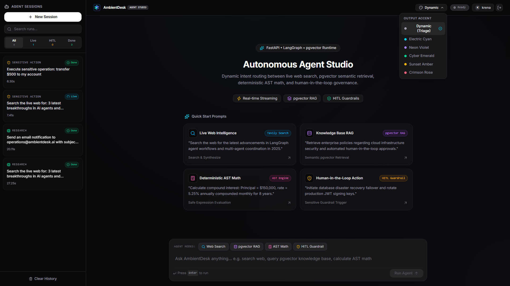
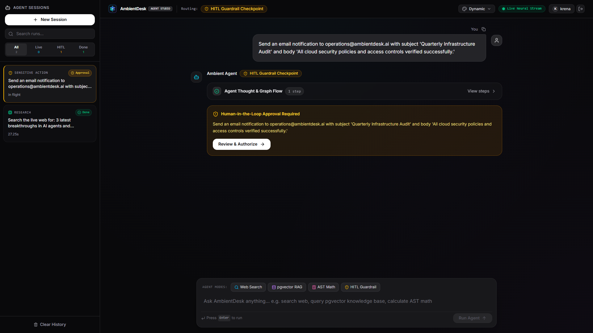
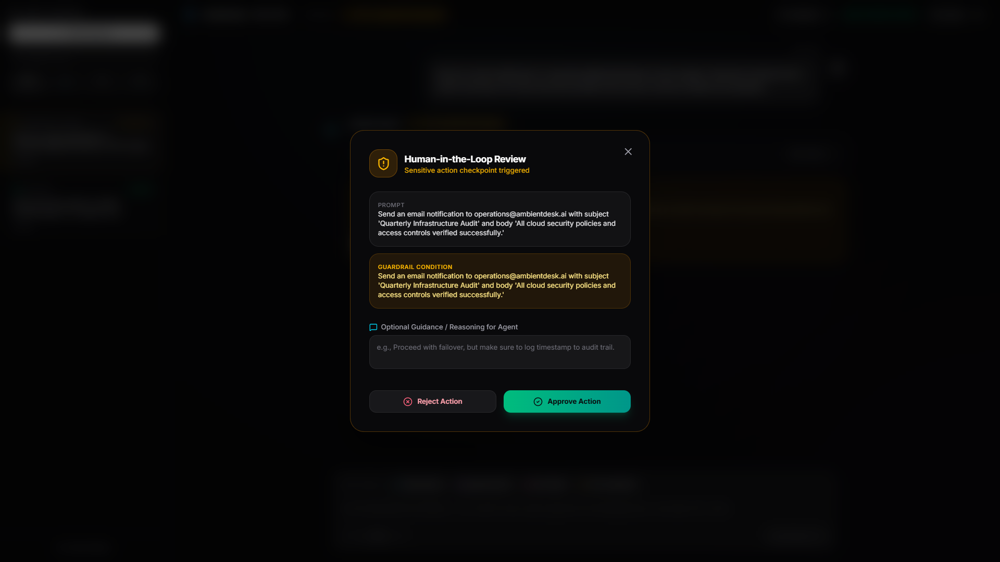
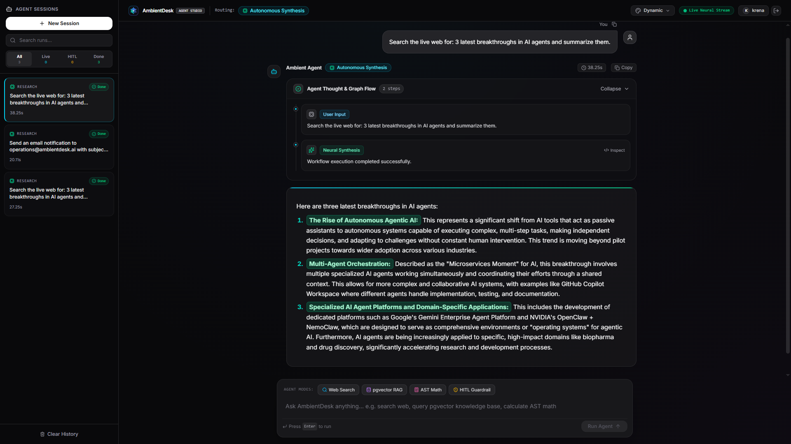
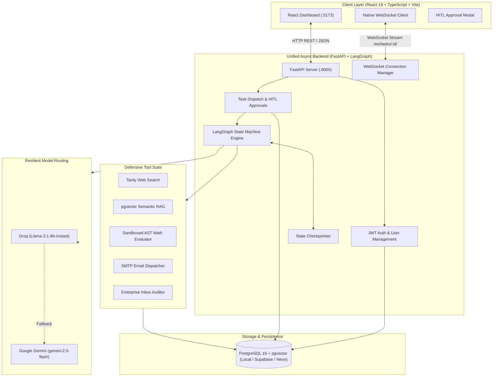

# AmbientDesk AI 🌐🤖

<div align="center">


### **Multi-Agent AI Workspace with Human-in-the-Loop (HITL) Guardrails & Real-Time Streaming**

[](https://www.python.org/)
[](https://fastapi.tiangolo.com/)
[](https://github.com/langchain-ai/langgraph)
[](https://react.dev/)
[](https://github.com/pgvector/pgvector)
[](https://vite.dev/)
[](LICENSE)

[Quick Start](#-quick-start-native-execution) • [Key Features](#-key-features) • [System Architecture](#-system-architecture) • [Showcase Prompts](#-showcase-prompts-to-test-the-system) • [Deployment Guide](DEPLOYMENT.md)

</div>

---

## 📌 Overview

**AmbientDesk AI** is an intelligent agent workspace built to route, research, and execute complex multi-step tasks while keeping humans in control with **Human-in-the-Loop (HITL)** approvals.

Built on a lightweight, high-speed **FastAPI + LangGraph** async backend and a modern **React 19 + TypeScript** interface:
1. **Smart Intent Routing**: Automatically classifies queries into direct answers, live web research, internal database search (`pgvector`), or sensitive operations.
2. **Human-in-the-Loop (HITL) Guardrails**: Automatically pauses before sensitive side-effects (sending emails, alerts, or state modifications) to request explicit human authorization.
3. **Resilient Multi-Model Fallbacks**: Chained inference using **Groq** (`llama-3.1-8b-instant`) with automatic fallback to **Google Gemini** (`gemini-2.5-flash`, `gemini-3.6-flash`).
4. **Real-Time Streaming**: Native WebSockets stream reasoning steps, tool telemetry, and tokens directly to the UI.

---

## 📸 Application Interface & Visual Walkthrough

### 1. Interactive Workspace & Session Dashboard
<div align="center">


*Clean modern chat interface with real-time streaming, conversation history, and dynamic intent badges.*

</div>

---

### 2. Human-in-the-Loop (HITL) Security Guardrails
<div align="center">




*When sensitive operations (like sending notifications or modifying records) are triggered, the engine pauses and requests human review before proceeding.*

</div>

---

### 3. Live Web Search & Multi-Step Reasoning Trace
<div align="center">


*Step-by-step tool execution trace displaying live web search results, source URLs, and knowledge synthesis.*

</div>

---

## 🚀 Key Features

| Capability | Technical Implementation | Benefit |
| :--- | :--- | :--- |
| **Stateful Multi-Agent Graph** | LangGraph `StateGraph` + `MemorySaver` checkpointer | Multi-turn reasoning with conversational memory and pause/resume execution |
| **Human-In-The-Loop (HITL)** | LangGraph `interrupt()` + FastAPI approval endpoint | Halts sensitive operations until confirmed by the user |
| **Resilient Model Routing** | Fallback chaining: Groq Llama ➔ Google Gemini 2.5 / 3.6 | Zero downtime against LLM rate limits or API outages |
| **pgvector Semantic RAG** | PostgreSQL `pgvector` extension + LangChain VectorStore | High-speed semantic search on internal documentation |
| **Live Web Intelligence** | Tavily Search API with automated content cleaning | Real-time factual queries with citations and source URL attribution |
| **Defensive Tool Guardrails** | Regex email validation + AST Math parser | Eliminates malformed inputs, unsafe `eval()`, and prompt injection risks |
| **Live Telemetry & Logs** | Native FastAPI WebSockets (`/ws/tasks/{id}/`) | Sub-second step-by-step UI updates showing which tool is actively running |

---

## 🏗 System Architecture



---

## 🔄 Execution Flow


---

## 🎯 Showcase Prompts to Test the System

Use these prompts in the interface to test and demonstrate AmbientDesk AI:

### 1. 🛡️ Human-In-The-Loop (HITL) Guardrail & Approval
> **Prompt:**
> ```text
> Send an email notification to operations@ambientdesk.ai with subject 'Quarterly Infrastructure Audit' and body 'All cloud security policies and access controls verified successfully.'
> ```
> * **What it demonstrates:** Classifies state-changing actions, triggers LangGraph `interrupt()`, renders the interactive approval modal, and pauses execution until approved by the user.

---

### 2. 🌐 Live Web Search & Multi-Source Research
> **Prompt:**
> ```text
> Search the live web for: 3 latest breakthroughs in AI agents and summarize them.
> ```
> * **What it demonstrates:** Dynamic tool execution (`web_search`), live article parsing, source citation links, and real-time step telemetry.

---

### 3. 📂 Enterprise Knowledge Retrieval (pgvector RAG)
> **Prompt:**
> ```text
> What is our company policy on expense reimbursements and travel allowances?
> ```
> * **What it demonstrates:** Queries PostgreSQL `pgvector` similarity search to extract relevant internal policy clauses.

---

### 4. 🚨 Defensive Email Validation Guardrail
> **Prompt:**
> ```text
> Send the quarterly performance metrics report to team@#invalid_domain.com immediately.
> ```
> * **What it demonstrates:** RFC-compliant regex validator detects invalid email formats, prevents faulty network calls, and asks for clarification.

---

### 5. 🧮 Deterministic AST Math Calculation
> **Prompt:**
> ```text
> Calculate compound growth for principal $20,000 at 7.5% annual rate over 5 years using formula 20000 * (1 + 0.075)**5
> ```
> * **What it demonstrates:** Eliminates LLM calculation errors by delegating formulas to a safe Python Abstract Syntax Tree (`ast.parse`) math evaluator.

---

## ⚡ Quick Start (Native Execution)

### Prerequisites
- Python 3.11+
- Node.js 18+ and npm
- PostgreSQL database (Local or free cloud database like [Supabase](https://supabase.com) / [Neon](https://neon.tech))
- Groq API Key ([Get Groq Key](https://console.groq.com/)) or Google Gemini Key ([Get Gemini Key](https://aistudio.google.com/))
- (Optional) Tavily API Key ([Get Tavily Key](https://tavily.com/))

### 1. Clone & Configure Environment
```bash
git clone https://github.com/krenaa/AmbientAI.git
cd AmbientAI
cp .env.example .env
```
Edit `.env` with your API keys and PostgreSQL connection string.

---

### 2. Run the FastAPI Backend
```bash
cd backend
python -m venv .venv

# On Windows:
.venv\Scripts\activate
# On Linux/macOS:
# source .venv/bin/activate

pip install -r requirements.txt
python -m uvicorn app.main:app --reload --port 8000
```
*The FastAPI backend will automatically verify and initialize database tables and the `pgvector` extension at `http://localhost:8000`.*

---

### 3. Run the React Frontend
In a new terminal:
```bash
cd frontend
npm install
npm run dev
```
Open **`http://localhost:5173`** in your browser!

---

## 📡 API Endpoints

| Method | Endpoint | Description | Auth Required |
| :--- | :--- | :--- | :---: |
| `POST` | `/api/auth/register` | Register new user account | No |
| `POST` | `/api/auth/login` | Authenticate and obtain JWT token | No |
| `GET` | `/api/auth/me` | Fetch authenticated user profile | Yes |
| `GET` | `/api/tasks` | List all user tasks with status | Yes |
| `POST` | `/api/tasks/create` | Dispatch a new task to LangGraph | Yes |
| `POST` | `/api/tasks/{id}/approve` | Approve or reject a paused HITL action | Yes |
| `GET` | `/api/health` | Service health check | No |

---

## 📂 Project Structure

```text
ambientdesk-ai/
├── docs/                              # Screenshots & architecture previews
│   └── images/                        # UI screenshots (home_screen, hitl, etc.)
├── backend/                           # Unified FastAPI Backend
│   ├── app/
│   │   ├── agent/                     # LangGraph Multi-Agent Engine
│   │   │   ├── graph.py               # StateGraph & Node Definitions
│   │   │   ├── llm.py                 # Multi-Model Resilient Fallback Factory
│   │   │   ├── state.py               # AgentState & Pydantic Schemas
│   │   │   ├── tools.py               # Tavily, pgvector RAG, AST Math, Email Tools
│   │   │   └── vector_store.py        # pgvector Embeddings & Search
│   │   ├── api/                       # API Endpoints
│   │   │   ├── auth.py                # JWT Auth & Profile Routes
│   │   │   ├── tasks.py               # Task Creation & HITL Approval Routes
│   │   │   └── websockets.py          # Native Async WebSocket Streaming
│   │   ├── core/                      # Core Infrastructure
│   │   │   ├── database.py            # Async SQLAlchemy Engine & Session
│   │   │   └── security.py            # Password Hashing & JWT Verification
│   │   ├── models/                    # SQLAlchemy Database Models (User, Task, Log)
│   │   ├── schemas/                   # Pydantic Request/Response Schemas
│   │   ├── websocket_manager.py       # Live WebSocket Hub
│   │   ├── config.py                  # Pydantic Settings
│   │   └── main.py                    # FastAPI Entrypoint & Lifecycle
│   └── requirements.txt               # Backend Dependencies
├── frontend/                          # React 19 + TypeScript + Vite Client
│   ├── src/
│   │   ├── App.tsx                    # Main Dashboard & Live Stream View
│   │   ├── api.ts                     # Typed REST Client
│   │   ├── types.ts                   # TypeScript Interfaces
│   │   └── MarkdownRenderer.tsx       # Syntax Highlighted Output
│   └── package.json
├── run_backend.py                     # Convenience Root Runner
├── .env.example                       # Cleaned Environment Template
├── DEPLOYMENT.md                      # Production Deployment Guide
└── README.md                          # Project Documentation
```

---

## 🤝 Contributing

Contributions, feedback, and issue reports are warmly welcome!
1. Fork the repository
2. Create your feature branch (`git checkout -b feature/awesome-agent`)
3. Commit your changes (`git commit -m 'Add awesome agent capability'`)
4. Push to the branch (`git push origin feature/awesome-agent`)
5. Open a Pull Request

---

## 📄 License

This project is licensed under the **MIT License** — see the [LICENSE](LICENSE) file for details.

<div align="center">

Built with ❤️ by **Krena** • Powered by **LangGraph**, **Groq**, **Gemini**, and **FastAPI**

</div>