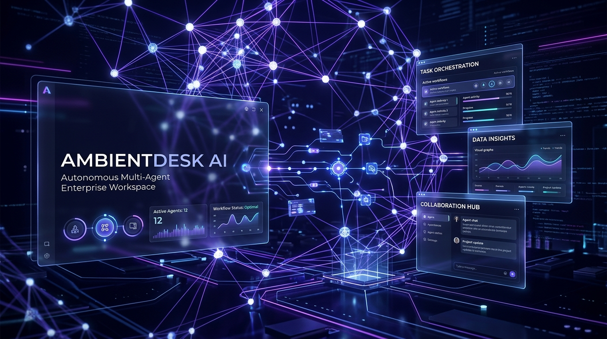
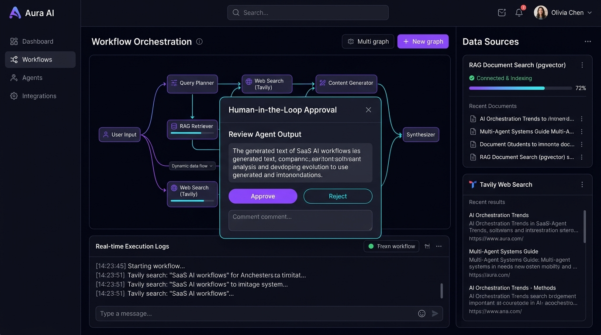
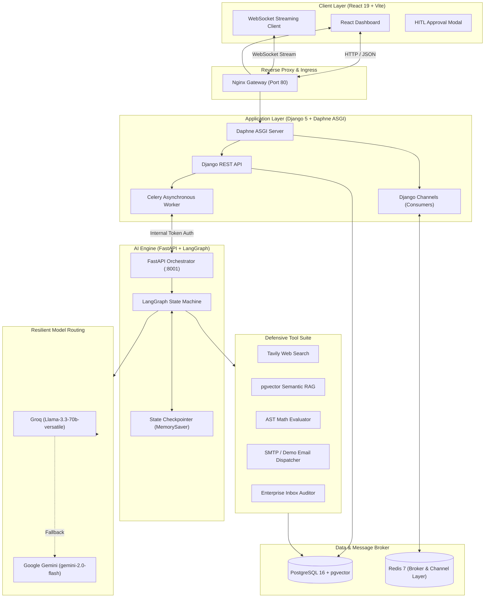
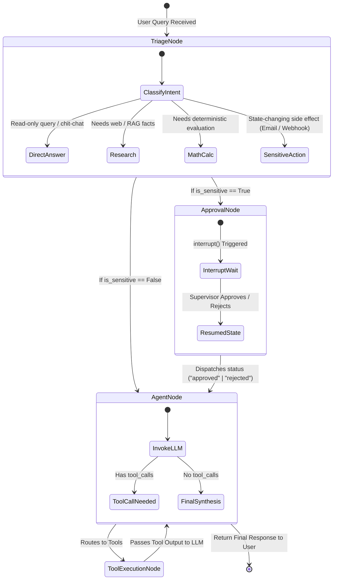

# AmbientDesk AI 🌐🤖

<div align="center">



### **Production-Grade Autonomous Multi-Agent Workspace with Human-in-the-Loop (HITL) Guardrails & Real-Time Streaming**

[](https://www.python.org/)
[](https://fastapi.tiangolo.com/)
[](https://github.com/langchain-ai/langgraph)
[](https://www.djangoproject.com/)
[](https://react.dev/)
[](https://github.com/pgvector/pgvector)
[](https://redis.io/)
[](https://www.docker.com/)
[](LICENSE)

[Live Demo](#quick-start-with-docker-compose) • [Key Features](#-key-features) • [System Architecture](#-system-architecture) • [Showcase Prompts](#-showcase-prompts-to-test-the-system) • [Deployment Guide](DEPLOYMENT.md)

</div>

---

## 📌 Executive Overview

**AmbientDesk AI** is an enterprise-grade agentic operating system designed to triage, orchestrate, and execute complex workflows autonomously while maintaining strict **Human-in-the-Loop (HITL)** governance and state persistence.

Traditional AI assistants either operate with unbound autonomy (risking hallucinations and unauthorized actions) or as simple reactive chatbots. **AmbientDesk AI bridges the enterprise gap** by providing:
1. **Intelligent Triage & Intent Routing**: Directs prompts to deterministic computation, web intelligence, internal vector search, or sensitive execution pipelines.
2. **LangGraph State Machine with `interrupt()`**: Halts execution before state-changing side effects (SMTP email, alerts, database mutations) for explicit human authorization.
3. **Resilient Dual-Model LLM Routing**: Primary ultra-fast inference via **Groq (Llama 3.3 70B)** with zero-downtime automated fallback to **Google Gemini 2.0 Flash**.
4. **Real-Time Asynchronous Streaming**: Full-duplex WebSocket communication streaming node lifecycle events, tool logs, and token generation directly to a modern React interface.

---

## 📸 System Visuals & UI Walkthrough

<div align="center">


*Real-time LangGraph multi-agent execution pipeline with Human-in-the-Loop (HITL) approval modal, pgvector RAG status, and live tool telemetry.*

</div>

---

## 🚀 Key Features

| Capability | Technical Implementation | Benefit |
| :--- | :--- | :--- |
| **Multi-Agent State Graph** | LangGraph `StateGraph` + `MemorySaver` checkpointer | Stateful multi-turn reasoning with conversational memory and interruptible execution |
| **Human-In-The-Loop (HITL)** | Native LangGraph `interrupt()` + Django approval endpoint | Prevents unauthorized emails, webhook dispatches, and financial/data modifications |
| **Resilient Model Routing** | Fallback chaining: Groq Llama 3.3 70B ➔ Gemini 2.0 Flash | 99.9% uptime against LLM rate limits and API outages |
| **pgvector Semantic RAG** | PostgreSQL `pgvector` extension + LangChain VectorStore | Accurate document retrieval from internal enterprise policies and technical specs |
| **Live Web Intelligence** | Tavily Search API with automated content cleaning | Real-time factual queries with citations and source URL attribution |
| **Defensive Tool Guardrails** | RFC-compliant Regex email validation + AST Math parser | Eliminates malformed inputs, unsafe `eval()`, and prompt injection edge-cases |
| **Live Telemetry & Logs** | Django Channels (ASGI) + Redis pub/sub layer | Sub-second step-by-step UI updates showing which tool or node is actively running |

---

## 🏗 System Architecture



---

## 🔄 LangGraph State Machine Execution Flow



---

## 🎯 Showcase Prompts to Test the System

Use these curated prompts in the interface to test and demonstrate each layer of AmbientDesk AI:

### 1. 🔗 Multi-Step Chained Workflow (Research ➔ Synthesize ➔ Email)
> **Prompt:**
> ```text
> Search the web for the top 3 zero-trust security best practices for AI agent deployments in 2026, synthesize an executive summary with cited sources, and email the brief to dev-lead@ambientdesk.ai
> ```
> * **What it demonstrates:** Dynamic tool chaining (`web_search` ➔ LLM synthesis ➔ `send_email`), conversational multi-step fulfillment, and defensive email recipient validation.

---

### 2. 🛡️ Human-In-The-Loop (HITL) Guardrail & Interruption
> **Prompt:**
> ```text
> Send an external notification to devops-alerts@ambientdesk.ai with subject 'Critical Database Migration Alert' informing the infrastructure team of scheduled downtime at 02:00 UTC.
> ```
> * **What it demonstrates:** Intent classification identifies state-changing side-effects, invokes LangGraph `interrupt()`, renders the glowing approval modal on the frontend, and pauses execution until approved by human.

---

### 3. 🚨 Defensive Guardrails & Malformed Input Handling
> **Prompt:**
> ```text
> Send the quarterly financial performance metrics report to fenil@#gmail.com immediately.
> ```
> * **What it demonstrates:** RFC-compliant regex defensive validator intercepts the illegal `#` character in the domain, prevents faulty network calls, and politely guides the user to confirm the valid address.

---

### 4. 📂 Enterprise Inbox Triage & RAG Cross-Referencing
> **Prompt:**
> ```text
> Check recent incoming emails for client inquiries regarding our RAG SLA terms, then search our pgvector knowledge base to draft a compliant response with citations.
> ```
> * **What it demonstrates:** `fetch_recent_emails` reads simulated/live enterprise communications ➔ triggers `knowledge_base_retrieval` against `pgvector` ➔ outputs contextual reply.

---

### 5. 🧮 Deterministic AST Math Calculation
> **Prompt:**
> ```text
> Calculate our projected cloud infrastructure burn rate: 450000 / 18 months with an 8.5% annual inflation buffer, and compare with sqrt(144000000).
> ```
> * **What it demonstrates:** Eliminates LLM numerical hallucinations by delegating formulas to a sandboxed Python Abstract Syntax Tree (`ast.parse`) math evaluator.

---

## ⚡ Quick Start with Docker Compose

### Prerequisites
- [Docker](https://docs.docker.com/get-docker/) & Docker Compose v2.20+
- Groq API Key ([Get Groq Key](https://console.groq.com/)) and/or Google Gemini Key ([Get Gemini Key](https://aistudio.google.com/))
- (Optional) Tavily API Key ([Get Tavily Key](https://tavily.com/))

### 1. Clone the Repository
```bash
git clone https://github.com/your-username/ambientdesk-ai.git
cd ambientdesk-ai
```

### 2. Configure Environment Variables
```bash
cp .env.example .env
```
Edit `.env` and fill in your API credentials:
```env
GROQ_API_KEY=gsk_your_groq_api_key_here
GOOGLE_API_KEY=AIzaSy_your_gemini_key_here
TAVILY_API_KEY=tvly_your_tavily_key_here
DJANGO_SECRET_KEY=your_secure_secret_key
POSTGRES_PASSWORD=your_db_password
```

### 3. Launch the Complete Multi-Container Stack
```bash
docker compose -f docker-compose.prod.yml up -d --build
```

### 4. Verify Services
Check running containers:
```bash
docker compose -f docker-compose.prod.yml ps
```
The stack will spin up 7 orchestrated containers:
- 🌐 **ambientdesk_gateway**: Nginx reverse proxy routing traffic on `http://localhost:80`
- 🖥️ **ambientdesk_frontend**: React 19 + Vite client served with Nginx
- ⚙️ **ambientdesk_backend**: Django REST Framework + Daphne ASGI (port 8000)
- 🧠 **ambientdesk_ai_agent**: FastAPI LangGraph state machine service (port 8001)
- ⚡ **ambientdesk_celery**: Asynchronous background task worker
- 🗄️ **ambientdesk_postgres**: PostgreSQL 16 with `pgvector` extension
- 🚦 **ambientdesk_redis**: Redis 7 message broker & WebSocket channel layer

Access the dashboard at **`http://localhost`**!

---

## 🛠️ Local Development Setup (Manual)

If you prefer running services independently without Docker:

### 1. Database & Cache
```bash
docker compose up -d postgres redis
```

### 2. AI Agent Engine (FastAPI)
```bash
cd services/ai-agent
python -m venv .venv
# On Windows: .venv\Scripts\activate | On Linux/Mac: source .venv/bin/activate
pip install -r requirements.txt
uvicorn app.main:app --host 0.0.0.0 --port 8001 --reload
```

### 3. Backend & Asynchronous Worker (Django)
```bash
cd services/backend
python -m venv .venv
# Activate virtual environment
pip install -r requirements.txt
python manage.py migrate
python manage.py runserver 8000
```
In a separate terminal, start the Celery worker:
```bash
celery -A core worker -l info
```

### 4. Frontend (React + Vite)
```bash
cd frontend
npm install
npm run dev
```
Open `http://localhost:5173` to test live changes with Hot Module Replacement (HMR).

---

## 📡 API & WebSocket Protocols

### REST Endpoints
| Method | Endpoint | Description | Auth Required |
| :--- | :--- | :--- | :---: |
| `POST` | `/api/accounts/register/` | Register new user account | No |
| `POST` | `/api/accounts/login/` | Authenticate and obtain session/token | No |
| `GET` | `/api/tasks/` | List all historical user tasks with status | Yes |
| `POST` | `/api/tasks/create/` | Dispatch a new task to LangGraph | Yes |
| `POST` | `/api/tasks/<id>/approve/` | Approve or reject a paused HITL action | Yes |

### WebSocket Real-Time Stream
- **URL:** `ws://localhost/ws/tasks/<task_id>/`
- **Events Broadcasted:**
  - `node_transition`: Emits `{ "node": "triage" | "approval" | "agent" | "tools" }`
  - `token_stream`: Real-time streaming tokens generated by the LLM
  - `hitl_requested`: Emitted when action requires human approval
  - `task_completed`: Final output payload and execution timing metrics

---

## 📂 Project Structure

```text
ambientdesk-ai/
├── docs/
│   └── images/
│       ├── banner.jpg                 # Project Hero Banner
│       └── workflow_preview.jpg       # HITL & Agent Architecture Graphic
├── frontend/                          # React 19 + TypeScript + Vite Client
│   ├── src/
│   │   ├── App.tsx                    # Main Dashboard & Stream View
│   │   ├── MarkdownRenderer.tsx       # Syntax Highlighted Output
│   │   ├── api.ts                     # REST Client
│   │   └── types.ts                   # TypeScript Interfaces
│   ├── Dockerfile
│   └── nginx.conf
├── services/
│   ├── ai-agent/                      # FastAPI + LangGraph Agent Core
│   │   ├── app/
│   │   │   ├── agent/
│   │   │   │   ├── graph.py           # LangGraph StateGraph & Node Definitions
│   │   │   │   ├── llm.py             # Groq & Gemini Resilient Fallback Factory
│   │   │   │   ├── state.py           # AgentState & Pydantic Schemas
│   │   │   │   ├── tools.py           # Tavily, pgvector, AST Math, Email Tools
│   │   │   │   └── vector_store.py    # pgvector Embeddings & Search
│   │   │   └── main.py                # FastAPI Application & Execution Endpoint
│   │   └── Dockerfile
│   └── backend/                       # Django 5 + Daphne ASGI Backend
│       ├── core/                      # Settings, ASGI/WS Routing, Celery Conf
│       ├── accounts/                  # Auth, Profiles, Security
│       ├── tasks/                     # Task Model, Consumers, Views, Celery Tasks
│       └── Dockerfile
├── nginx/
│   └── nginx.conf                     # Production Gateway Reverse Proxy
├── docker-compose.yml                 # Local PostgreSQL & Redis stack
├── docker-compose.prod.yml            # Complete 7-container production stack
├── DEPLOYMENT.md                      # Cloud VPS / Ubuntu / Certbot Setup
└── README.md                          # Project Documentation
```

---

## 🛡️ Security & Enterprise Governance

- **Zero-Trust Tool Execution**: Tools that execute state mutations are barred from silent execution; LangGraph explicitly pauses for user confirmation.
- **Safe Evaluation**: Code execution and math expressions are parsed via AST validation without ever invoking Python's dangerous `eval()`.
- **Sanitized Prompts & Inputs**: Web search snippets and retrieved documents are cleansed of raw markdown artifacts and delimiter injection threats.
- **Service-to-Service Isolation**: The AI Agent FastAPI service communicates with Django backend using internal token verification (`AI_AGENT_INTERNAL_TOKEN`).

---

## 🤝 Contributing

Contributions, feedback, and issue reports are warmly welcome!
1. Fork the repository
2. Create your feature branch (`git checkout -b feature/awesome-agent`)
3. Commit your changes (`git commit -m 'Add awesome agent capability'`)
4. Push to the branch (`git push origin feature/awesome-agent`)
5. Open a Pull Request

---

## 📄 License

This project is licensed under the **MIT License** — see the [LICENSE](LICENSE) file for details.

<div align="center">

Built with ❤️ by **Fenil** • Powered by **LangGraph**, **Groq**, **Gemini**, and **Django**

</div>